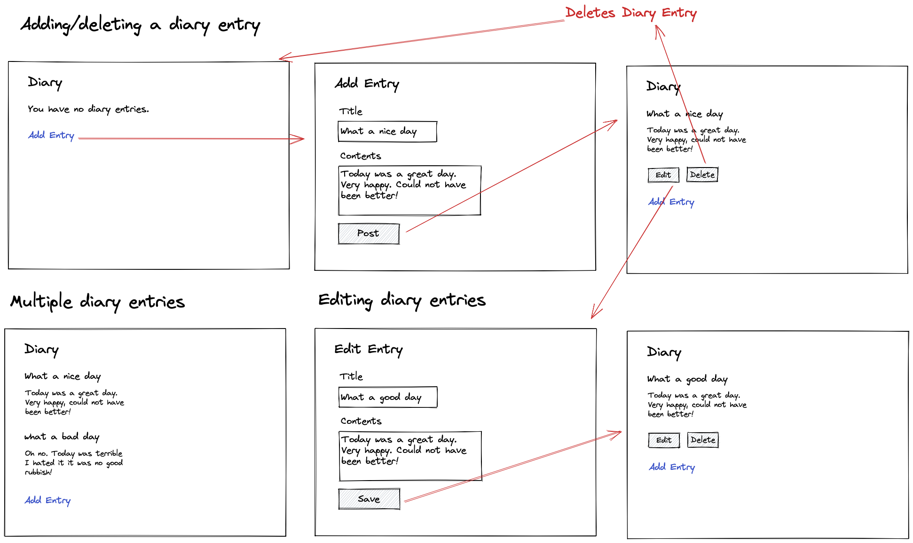

# {{PROBLEM}} Web Design Recipe (Level Three)

## 1. Describe the Problem

1. The client has requested that they can add a new space to be booked.
Requirements: The user has to have signed up to the site in order to add a space which can be booked.
01/06/2022 - Authentication missing

2. The client has requested that they're able to add more than one property to their account.
Requirement: The user should be able to add any number of properties available to be booked.
01/06/2022 13:39 - I need to add a foreign key to the property table with that references the user id

3. Users should be able to name their space, provide a short description of the space and a price per night
Requirements: The user wants to be able to name their space, provide a short description of the space and a price per night.
DONE

4. Users should be able to offer a range of dates when their space is available to book
Requirements: Have a date selector that will show when the property is available to be booked.
DONE

5. Any signed up user can request to hire any space for one night, and this has to be approved by the user that owns the space
Requirements: Once the owner receives a booking request, they have to approve the booking before the property is booked.

6. Nights that have already been booked shouldn't allow other users to book it
Requirements: When the property is booked, during those dates the property should not be visible to other users trying to book it.

7. Until a user has had a confirmation, the space is still available to be booked.
Requirements: The owner has to approve the booking before the booking is confirmed, meaning the place can still be booked until this has happened.


#OH BOY
Users should receive an email whenever any of the following happens:
They sign up
They create a space
They update a space
A user requests to book their space
They confirm a request
They request to book a space
Their request to book a space is confirmed
Their request to book a space is denied
Users should receive a text message to a provided number whenever one of the following happens:
A user requests to book their space
Their request to book a space is confirmed
Their request to book a space is denied
A ‘chat’ functionality once a space has been booked, allowing users whose space-booking request has been confirmed to chat with the user that owns that space
Basic payment implementation though Stripe.


_Put or write the user stories here. Add any clarifying notes you might have._

## 2. Design the Interface

_This is the fun part! Use excalidraw.com or a similar tool to design some
wireframes (rough sketches of the user interface). Include interactions and
transitions between pages — those are the most critical part._



## 3. Design the Database


```plain
client

+------------------------+-------------------------+-------------------------+------------------------+--------------------------+
| id(SERIAL PRIMARY KEY) | username(TEXT NOT NULL) | password(TEXT NOT NULL) | contact(TEXT NOT NULL) |   email(TEXT NOT NULL)   |
+------------------------+-------------------------+-------------------------+------------------------+--------------------------+
|                      1 | Endre                   | nopassword              |              075987654 | iwonttellyou@gmail.com   |
|                      2 | Tom                     | yespassword             |              075123456 | iwilltellyou@gmail.com   |
|                      3 | Nathan                  | maybepassword           |              075987123 | imaytellyou@gmail.com    |
|                      4 | Mohammed                | thereisnopassword       |              075676666 | thereisnoemail@gmail.com |
+------------------------+-------------------------+-------------------------+------------------------+--------------------------+
```


```plain
properties table

+------------------------+------------------------------+-----------------------------------+-----------------------+-----------------------------------+---------------------------------+
| id(SERIAL PRIMARY KEY) | property_name(TEXT NOT NULL) |    description(TEXT NOT NULL)     | price(FLOAT NOT NULL) | availability_start(DATE NOT NULL) | availability_end(DATE NOT NULL) |
+------------------------+------------------------------+-----------------------------------+-----------------------+-----------------------------------+---------------------------------+
|                      1 | "Makers dungeon"             | "Sometimes dark sometimes bright" |                    89 | 2022-04-20                        | 2022-07-15                      |
|                      2 | "Openbet office"             | "Unspecified"                     |                    67 | 2022-07-15                        | 2024-07-15                      |
|                      3 | "Capgemini"                  | "Very good, very chill"           |                    95 | 2022-07-15                        | 2022-06-30                      |
|                      4 | "UK Hydrographics"           | "Such place, very wow"            |                   100 | 2022-08-11                        | 2023-09-10                      |
+------------------------+------------------------------+-----------------------------------+-----------------------+-----------------------------------+---------------------------------+
```

_Design the data tables that will store all of the information your application
manages. Include the data types and examples of three rows. Consider use Google
Sheets or [AsciiTable](https://ozh.github.io/ascii-tables/) to do this._

```plain
# Example

Table name: diary_entries

| id (NUMBER) |  title (TEXT)   |     contents (TEXT)      |
|-------------|-----------------|--------------------------|
|           1 | What a nice day | Today was a great day... |
|           2 | What a bad day  | Today was an awful da... |
|           3 | What a cool day | Today was a cool day ... |
```

## 4. Create Examples of User Interactions

_Create examples of user interactions and expectations._

```ruby
# As you learn the testing tools you might start writing with realistic test
# code here, but at the start it's OK if it's just English or made up code.

# View no entries
visit "/diary"
# User sees: You have no diary entries.

# Add an entry
visit "/diary"
click link "Add Entry"
enter "A beautiful day" into "Title" field
enter "I had a very nice day it's true." into "Contents" field
click button "Post"
# User sees in the diary list:
# A beautiful day
# I had a very nice day it's true.

# Multiple entries
visit "/diary"
click link "Add Entry"
enter "A beautiful day" into "Title" field
enter "I had a very nice day it's true." into "Contents" field
click button "Post"
click link "Add Entry"
enter "A bad day" into "Title" field
enter "I had a very bad day." into "Contents" field
click button "Post"
# User sees in the diary list:
# A bad day
# I had a very bad day.
# A beautiful day
# I had a very nice day it's true.
```

## 6. Test-Drive the Behaviour

_Follow this cycle:_

1. Add a feature test in `/spec/feature/` (RED)
2. Implement the behaviour in `app.rb`
3. Does it pass without data model changes? (GREEN) Then skip to step 6.
4. Otherwise, add a unit test for the data model to `/spec/unit` (RED)
5. Implement the behaviour in your data model class. (GREEN)
6. Apply any refactors to improve the structure of the code. (REFACTOR)  
   Run `rubocop` as part of this.
7. Go back to step 1.


<!-- BEGIN GENERATED SECTION DO NOT EDIT -->

---

**How was this resource?**  
[😫](https://airtable.com/shrUJ3t7KLMqVRFKR?prefill_Repository=makersacademy/web-starter-level-three&prefill_File=recipe/recipe.md&prefill_Sentiment=😫) [😕](https://airtable.com/shrUJ3t7KLMqVRFKR?prefill_Repository=makersacademy/web-starter-level-three&prefill_File=recipe/recipe.md&prefill_Sentiment=😕) [😐](https://airtable.com/shrUJ3t7KLMqVRFKR?prefill_Repository=makersacademy/web-starter-level-three&prefill_File=recipe/recipe.md&prefill_Sentiment=😐) [🙂](https://airtable.com/shrUJ3t7KLMqVRFKR?prefill_Repository=makersacademy/web-starter-level-three&prefill_File=recipe/recipe.md&prefill_Sentiment=🙂) [😀](https://airtable.com/shrUJ3t7KLMqVRFKR?prefill_Repository=makersacademy/web-starter-level-three&prefill_File=recipe/recipe.md&prefill_Sentiment=😀)  
Click an emoji to tell us.

<!-- END GENERATED SECTION DO NOT EDIT -->
